# 6 Data Visualization...and my first try at predictions - Bootcamp Project

## Background

At this point, we were two and a half months into the bootcamp. I had started dreaming in code, my best friend was stack overflow, and I was debugging in my head so much that I could no longer hold a conversation with someone. We were given 2 weeks to do a data visualization project, the only criteria was we had to use APIs as a source of data. 

Being the cinephile I am, I embarked on the journey to determine the attributes of Oscar-nominated films, what trends exist in winning and losing movies, and to ultimately predict what film will likely take home the  91st (2018) Academy Award for Best Picture (premiering on Feb 24, 2019). 

### Work Flow

* I divided the project into Extraction, Transformtion, Predicition, and Plotting. See the image below. At this point we were not familiar with databases such as MongoDB or SQL, so I resorted to csvs.

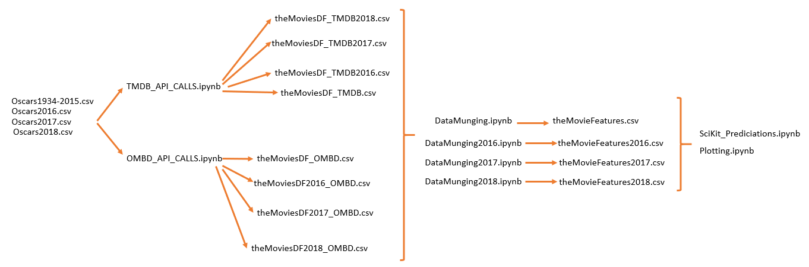

### Data Extraction

* I found a csv on Kaggle for all oscar awards won between 1927 and 2015. However, I am focusing only on the Best Picture prive which was introduced in 1944; therefore, my date range is 1944-2015. I used the movie titles from this spreadsheet to make API calls.

* I used the OMDB API to get information such as Genre, Rating, Release Date, etc. OMDB is a fairly basic API, so no difficulties here.

* I also used the TMDB API to get information such as popularity, revenue, budget, etc. The only tricky part here, was that I technically had to do an initial API call to get the movie_id by searching movie title to be able to do a more detailed query by movie id to get more information.

### Data Transformation

This is where I learned that 80-90% of any data project is 'cleaning data'! The tricky parts were:

* Handling movie remakes (e.g. Moulin Rouge 2001 vs. Moulin Rouge 1952)
* Ensuring that the movie Titles between all my data sources (kaggle csv, OMDB and TMDB data) matched to be able to do clean joins.
* Removing string values to be able to feed into prediction model later. For example, with movie genre I wanted 0s and 1s if they fell into a certain movie genre. 

### Plotting

##### Cast Awards

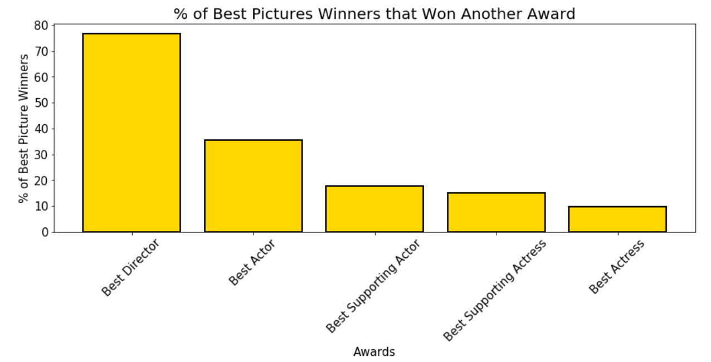

The only staggering thing here is that 77% of movies winning Best Picture are also winning Best Director. 

##### Month of Release

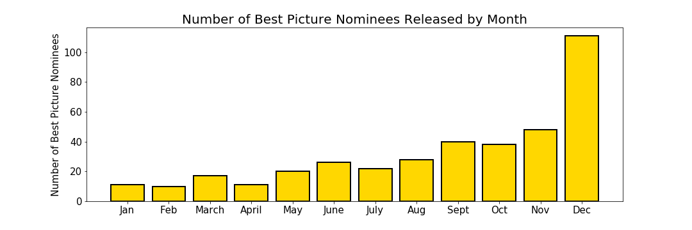

The plot above shows that the majority of Best Picture nominated films are released in December!

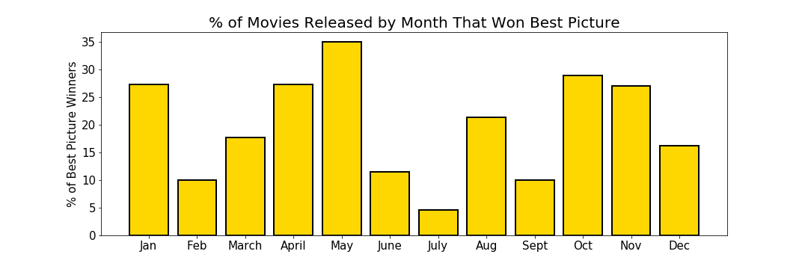

When you normalize the data based on number of winners you see that May actually has the highest percentage of winners. Future film makers....it may be beneficial to release your movie in a slower month as people will revel in it without it getting lost in the hype of other competing movies that are released around the same time.

##### Movie Popularity

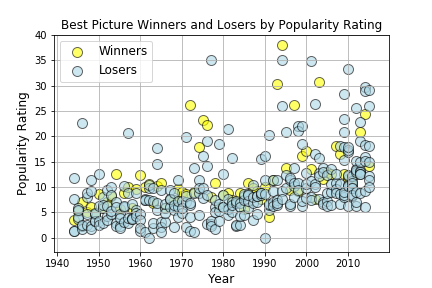

No real difference in popularity between movies that win Best Picture and movies that lose Best Picture. Good to know that movies being nominated are 'generally' well liked.

##### Movie Genre

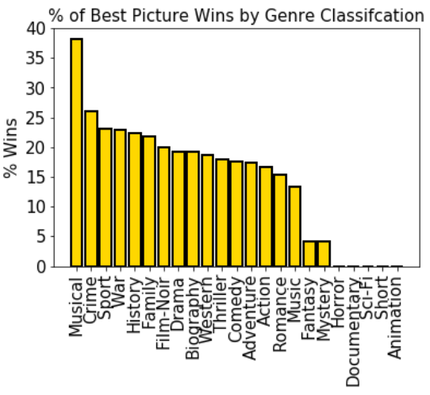

Interesting how such a high percentage of Musical movies are winning Best Picture. This may be an artifact of the 1940s-1960s when a lot of movies were musicals (e.g. My Fair Lady, Sound of Music, Singing in the Rain, etc.)

##### Movie Rating

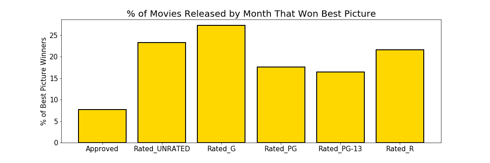

The plot above is a little deceiving. It shows that a lot of G-rated films win best picture. 

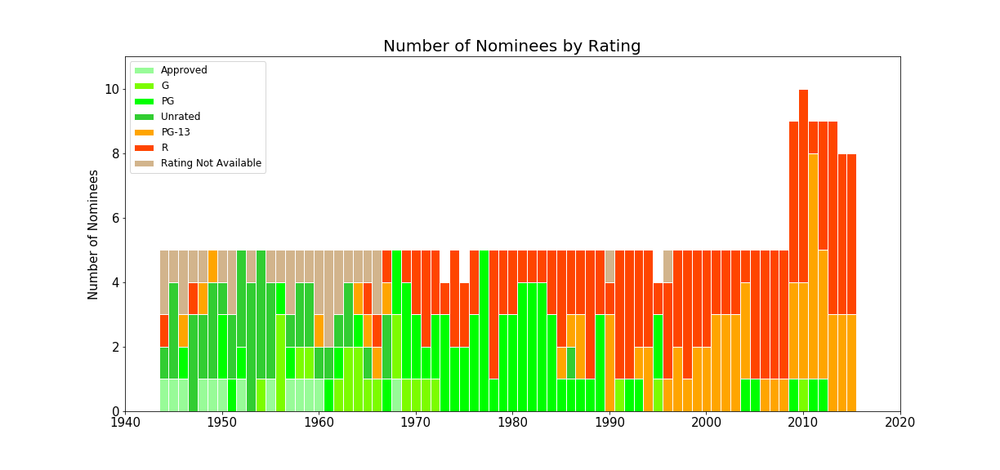

However, when you take into account year, you see a shift from wholesome family films (rated G and unrated) in the 1940s-1970s to more mature films (rated PG-13 and rated R) in the 1980s-2010s. 

### Prediction

Disclaimer.....I have very limited knowledge of machine learning, I am not claiming to be a data scientist proficient in predictive modeling. However, it fascinates me and I wanted to take a stab at a simple prediciton model. With Best Picture we have winners and losers and that is a simple classification problem that can be boiled down to 1s and 0s. I had extracted 53 features from 384 oscar Best Picture nominees from 1944 to 2015. 

I taught myself the bare bones of how to use the python library `SciKit Learn` and ran a logistic regression on the 53 features to get a coefficient to determine that feature's weight on winning Best Picture. 

I also did a recursive feature elimination to determine what were the top 10 most import features in determining Best Picture. My laymen way to explain this is.....it will assign weights to all 53 features (the coefficients of a linear model transformed logistically) and then drop the least important (lowest weight or coefficient closest to 0) and then move on to all iterations of 52 features (because I was telling the model to drop one feature at a time) and then drop the least important feature. And then move on to iterations of 51, drop least important, so on so forth for a set amount of iterations. The top 10 most important features are:

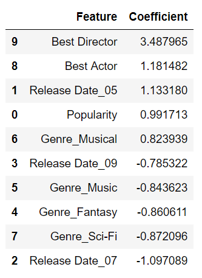

#### Testing Model on 2016 Oscars

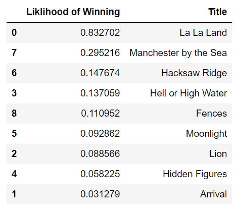

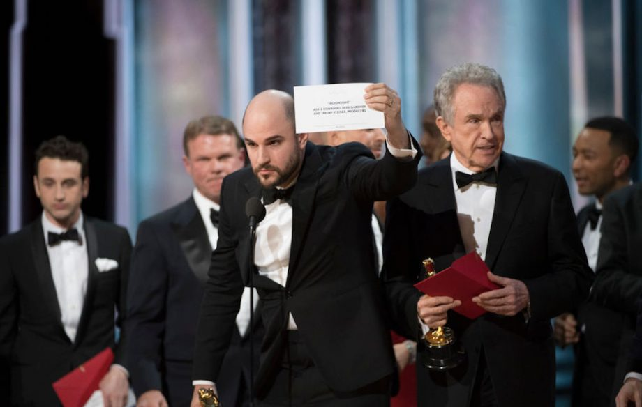

Well....turns out I predicted wrong. I predicted La La Land when it was actually Moonlight that won in 2016. 

#### Testing Model on 2017 Oscars

Success.....Model predicted Shape of Water would win and it did win Best Picture in 2017! 1 out of 2 not so bad for first prediciton model.

#### Predicting 2018 Oscars

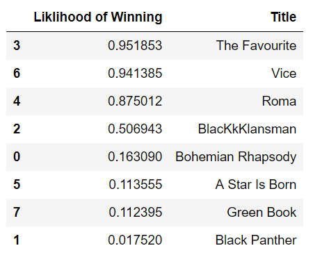

So currently the model is predicting that the movie The Favourite is going to take home the prize. However, a couple of assumptions were made here. Because the model depends on other oscar wins (Best Director, Best Actor and Supporting Actor, and Best Acctress and Supporting Acctress) I will only be able to run my model properly as the oscars are premiering on Feb 24, 2019. Until then, I made the assumption that if a best picture nominated movie was also nominated for any of the other awards, it will be considered a win. For example, Blackkklansman, The Favourite, Roma, and Vice are all nominated for Best Director and my model is currently considering they all won Best Director.  So stay tuned.....Feb 25th I'll be puplishing the final results of my model!

##### Update Post Oscars

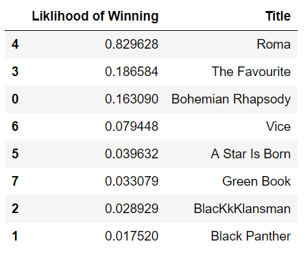

So as I was watching the oscars live, I was updating the cast awards (best actor/actress, best supporting actor/actress, and best director) and refeeding the model. Right before the announced Best Picture my model was fully fledged and predicting Roma to win! But I knew even before the movie was announced that my model was wrong...Roma had already won best Foreign Film. My model model was predicting it to win Best Picture because it had won Best Director (the feature that was determined to be the most important)
And the oscar goes to.....GREEN BOOK!

Well....this was fun. 

### Data Implications

So what has this all taught me....

* A predictive model is only as good as the data you feed it. Did I pick meaningful features? Did I have enough data to train model? Absolutely not, lol. 

* The model does not take into account: (1) what competitor movies a given movie is facing, (2) whether the movie has won in other categories not considered (e.g. Foreign Film), (3) whether cast of a movie already had oscars from previous seasons, etc. This was a 'bare bones' model.

* The training data looks at data from 1944-2015. the model treats the results from all years equally. In reality, the results of later years (e.g. post 2000s) are more indicative of what is likely to happen in 2018 than the results of 1944.

* The model does not take into account social issues (e.g. #OscarsSoWhite, demographics, Harvey Weinstein scandal, etc.)

