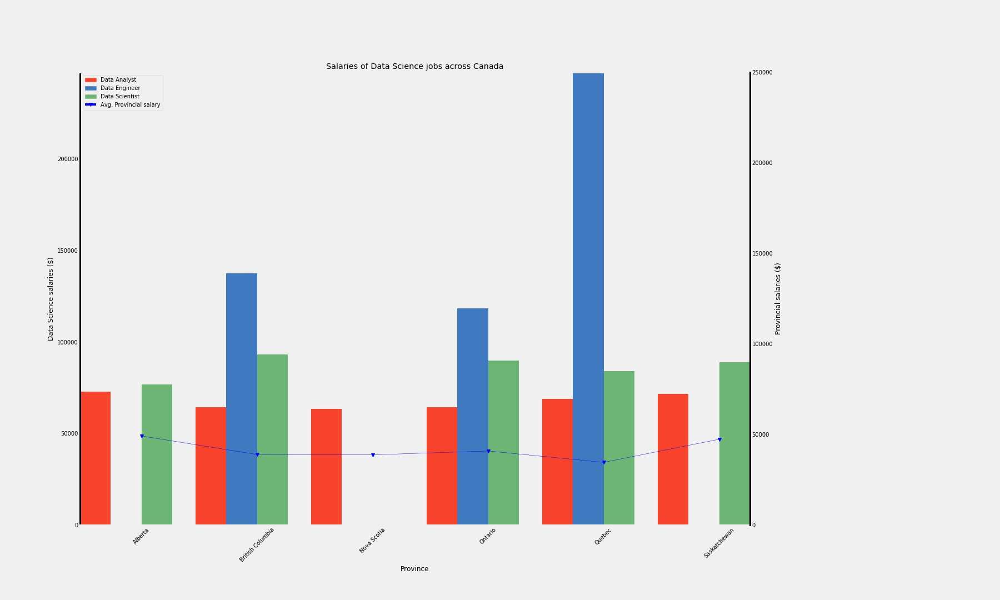

# 11 Extract Transform Load (ETL) - Bootcamp Project 

## Background

This was a group project! The focus was to do the full stack of data operations: Extraction, Transformation, Loading, and Analysis.

My group decided to focus on a topic that was 'close to home' for all of us....the job market for 'data' positions in Canada.

This project focuses on determining the available opportunities for the three main Data career streams of Data Analyst, Data Engineer, and Data Scientist.  Opportunities being advertised in job websites, such as Indeed.com, will be extracted and correlated with key quality of life metrics for the locations where these opportunities exist in Canada.  This project will not only determine where most opportunities are found, but also where these opportunities will be most advantageous economically. 

### Methods

Using the ETL processes, the following tasks were done:

1) Extraction of the Data Analyst, Data Engineer, and Data Scientist positions from Indeed.ca

2) Extraction of Salary data for Data Analyst, Data Engineer, and Data Scientist positions from indeed.ca

3) Extraction of the Cost of Living information for Canadian cities from Numbeo API

4) Extraction of the population information for Canadian locations from Statistics Canada API

5) Transformation of all extracted data into 5 ‘clean’ dataframes: (1) job_class, (2) provinces, (3) salaries, (4) jobs, and (5) cities.

6) Load all dataframes into a SQL database

7) The use of matplotlib for visualization of the relationship between Data Science open positions, their locations, and their related cost of living and population information, through database queries

I was resonsible for tasks (2), (5), (6), and part of (7). And will only be presenting my code.

### Step 2 - Salary Data Extraction

Initally the plan was to scrape Glassdoor for salary information. Unfortunately, it was discovered that the website was not condusive to web scraping with security against 'bot' activity. So, Indeed was used as a source of salary information (indeed.ca/salaries).

A series of loops were set up to change the url to account for page number, province, and position (Data Analyst, Data Engineer, and Data Scientist). Once scraped, the data needed to be slightly cleaned up to change the salary figure into a decimal, and adjust the salary to an annual amount as some of the salaries were reported in 'per hour', 'per week', and 'per month' amounts. The file used to perform this scrape was 'Salary_Scrape_2.0_SH.ipynb'

### Steps 5 and 6 - Transformation and Loading

Before loading data into SQL, the extracted inputs needed to be transformed relative to each other to ensure clean data is loaded. The file used to do the final transformation and load into SQL is ‘Transform_IntoSQL_SH.jpynb’.

The extracted inputs to this file are as follows:
* Indeed.ca scrape for salaries of Data Analyst, Data Scientist, Data Engineer by province in csv form (Salary_extracted_input.csv).
* Indeed.ca scrape for job postings for Data Analyst, Data Engineer, Data Scientist positions in Canada is csv form (Job_Posting_extracted_input.csv)
* Canadian city information from Stats Canada API and Numbeo API in csv form (complete_city_df.csv)
* Canadian province information from Stats Canada API and Numbeo API in csv form (province_df.csv)

The purpose of this section of the project is to create 5 clean tables that are interlinked and loaded onto MySQL. The 5 tables are: Job_Class, Jobs, Cities, Provinces, Salaries.

#### Job_Class Table

The Job_Class table was a manually made dataframe to assign a Class_ID (eventually will act as primary key in SQL) to Data Analyst, Data Engineer, and Data Scientist. We included an Other Job_Class because the job posting scrap yielded job titles other than Data Analyst, Data Engineer, and Data Scientist, and we did not want to discard them as they had ‘Data’ in the job title.

#### Provinces Table

The base of the provinces table was made from a pd.read_html scrape of the Wikipedia page for Canadian provinces. It was merged with the province_df.csv on the province abbreviation. Each province was given a province_ID that will act as a primary key in SQL. ‘Other’ was also included in the provinces table because some of the cities yielded from the job postings scrape of indeed.ca could not be matched to city on the city table and therefore could not be matched to a province.

#### Salaries Table

The salaries table needed to be merged with the job_class Table and Province Table. Prior to the merges, the provinces column of the raw salaries table (from the Salary_extracted_input.csv) needed to be match the provinces column of the provinces table in terms of string. The python library ‘fuzzy wuzzy’ (string matching library) was used to accomplish this. 

#### Cities Table

The raw city table (from complete_city_df.csv) needed to be merged with the provinces table. Prior to merging, an ‘Other’ city needed to be created with ‘Other’ as the province because the jobs table included cities that are not in the city table that will be categories under ‘Other’. A unique city_ID is assigned to all the cities in the city table (to act as the primary key in SQL).

#### Jobs Table

The raw data of the jobs table (Job_Posting_extracted_input.csv) included columns city, company, job title, province, and summary. This table needed to be merged with the job_class table, provinces table, and city table. Prior to the merges, several steps had to be performed to ensure clean merges:

* Python library unidecode was used on the city column to remove any accents from the French cities (as the city table did not include city names with accents).
* A list of cities that were in the jobs table but not in the city table were generated. The python library ‘fuzzy wuzzy’ with a score cutoff (80) was used to determine any semantic differences (e.g. Toronto vs. Greater Toronto Area, St. Catherines vs. St. Catharines, Saanich vs. North Saanich). Cities in the jobs table identified to have minor semantic differences to cities in the cities table were changed. All remaining cities in the jobs table that were not in the cities table were categorized under ‘Other’.
* The provinces in the jobs table were also corrected with fuzzy wuzzy as mentioned before.

#### Load into SQL

The final dataframes for the Job_Class, provinces, cities, salaries, and jobs were loaded onto SQL through python by creating an engine and using the pd.to_sql method. Primary keys were set using the engine.execute method where the SQL query 'ALTER TABLE `table name` ADD PRIMARY KEY (`column name`);' was called. The final data base schema looks as follows:

### Step 7 - Data Analysis (Salary Analysis)

The average salaries for the different job classes in Data jobs were aggregated based on province.  

The average annual salaries for Data Science positions are greater than the average annual salary of other positions across all provinces.  Salary comparison of these Data Science postings show that data engineers command the highest average salary, while the data analysts earn the lowest.

Provincially, the earning power for data engineers in Quebec earn more than four times the Quebec provincial average.  In fact, job postings for data engineers are the highest nationally in a province with the lowest provincial average salary.  Posting for data engineers in BC are equivalent to three times the provincial average salary.

The average salary of data scientist positions is very similar across all provinces, with the highest in BC followed closely by Ontario.
Similarly, the data analysts also have very similar salaries across the provinces, with the highest salaries offered in Alberta and Saskatchewan.

### Copyright

Coding Boot Camp © 2018. All Rights Reserved.
