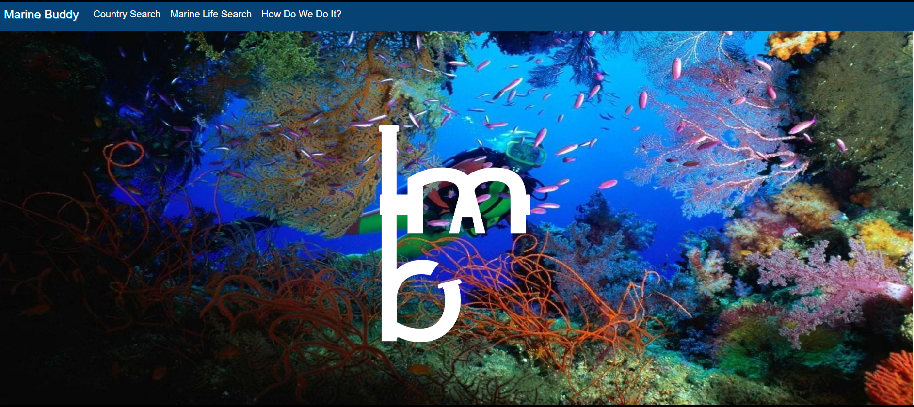
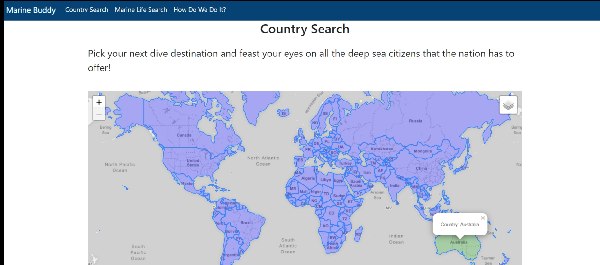
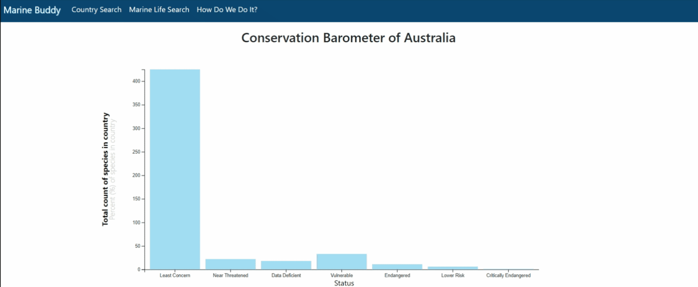
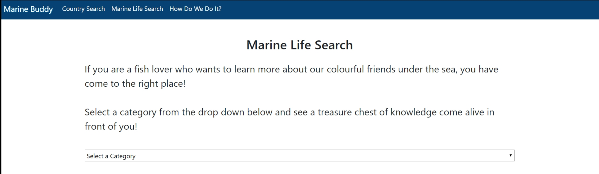
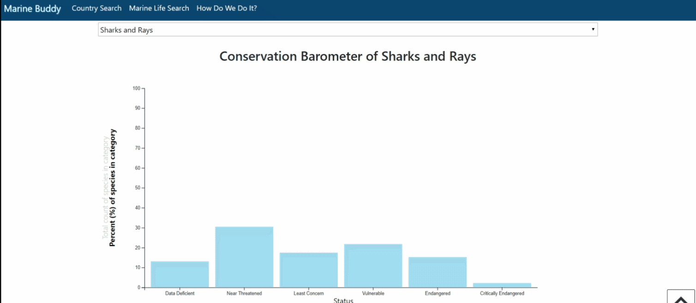

# 17 Final Project - Marine Buddy! 

## Background

I love Scuba Diving! I revolve all of my vacations around scuba diving. The inspiration for this project came from problems I was facing during my vacation planning. When planning a trip I quickly had 10+ tabs open all with little bits of information that I was seeking while planning. In a nutshell....I plan my vacations one of two ways:

1) Either I know where I am traveling to and I just want to learn about the marine life I'm going to see. Or,
2) I want to plan a whole trip around seeing a certain species and I just want to know where I have to go.

Enter.....Marine Buddy! There are 2 ways to search for marine life on this app...either a country search or marine-life search.

### Country Search

On the country search page, the user is greeted with a world map (generated through leaflet). There is a geojson layer with a clickable countries. Once a country is selected, it turns green and a tool tip pops up with the country's name. An API call to the database is made with the country name as an argument to populate the dropdown menu for marine life categories with categories that are specific to the country selected. Addtionally, a D3 bar graph is populated on the page. The graph displays the number or percent (depending on the axis selected) of species in the country by conservation status. 

Once the user selects a category of marine life from the dropdown, another API call is made (where country and category are arguments) to pull all details for species that fit that category and country criteria. There is a loading gif of a surgeon fish while this API call is being performed. Once complete the page is populated with flip cards of all the species returned. The front of the card is a single image of the species. On the back of the card there is: (1) common name, (2) scientific name, (3) depth, (4) population trend, (5) conservation status, (6) a link to IUCN (conservation website), (7) a button for a modal popup with an image slider.  

### Marine Life Search

This page is to explore various marine life. The user is created with a dropdown of all the marine life categories (23 in total). Once a category is selected, the same loading icon (gif of surgeon fish) appears on the page while an API call is performed to retreive information about all the species in the category selected. A D3 bar graph populates on the page to give the user insight about the number or percent (depends on the axis selected) of species in the selected marine life category by conservation status. 

Along with the bar graph, flip cards populate on the page with all the species in the category selected.The front of the card is a single image of the species. On the back of the card there is: (1) common name, (2) scientific name, (3) depth, (4) population trend, (5) conservation status, (6) a 'call map' button that opens a modal with a world map where the countries highlighted in green are where the selected species is prevalent, (7) a button for a modal popup with an image slider.  

### Data modeling

The database was created by scraping 2 marine life encyclopedias for scientific names, images, and facts. Followed by making API calls to IUCN Red List API to gain further information, most important being the countries where species exist. 

Obstacles faced during ETL include:

* There was overlap of species between the two marine encyclopedias (required fuzzy matching of names, image array merging, and joins)
* Ensuring the strings for countries from the geojson and the API calls matched (required consolidation and fuzzy matching)
* Dealing with arrays of information in single cells of dataframe that needed to be exploded into multiple rows before SQL load
* Consolidating like information between multiple sources

The final schema loaded onto SQL resembles below:

### Accreditation

I worked on this project with [Jesse Gray](https://github.com/jessewgray) and [Mariaveronica Sayewich](https://github.com/mvsayewich).

